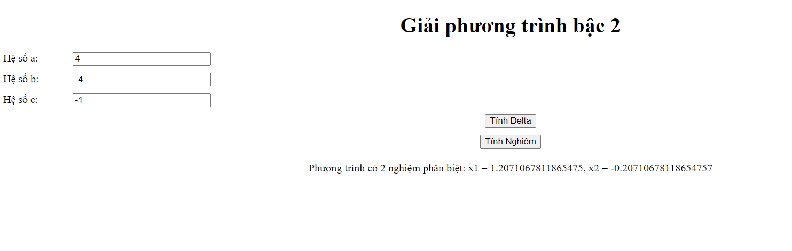
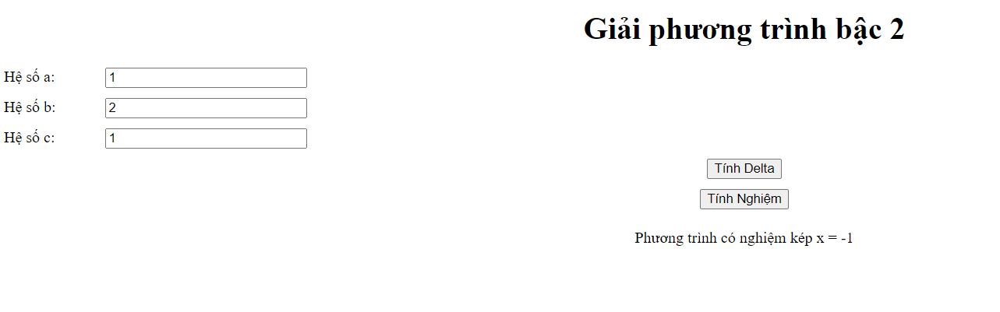
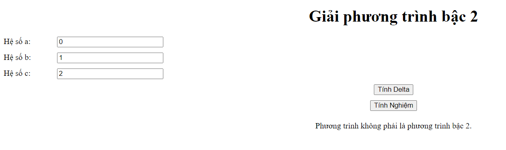
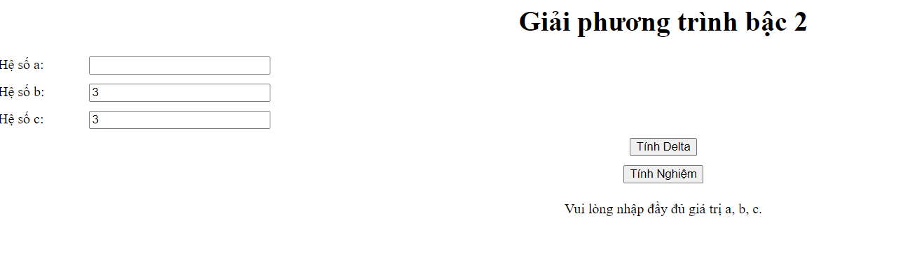
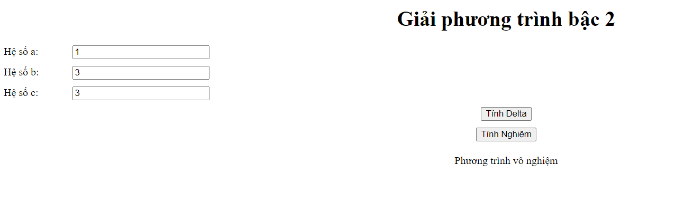

## Dự án kiểm thử phần mềm web basecic 

### Version: 1.0.0
#### Mô tả : Web giao diện tính phương trình bậc 2 một ẩn ( ax^2 + bx + c = 0 )
#### Công nghệ : webapp dùng html , css , js
#### Test case 
- Link gg sheet : [Link](https://docs.google.com/spreadsheets/d/120lO2aVFPZ1vhJBgM7dm30eImyxx8G6qNbwkrohP-GE/edit?usp=sharing)
- Ảnh minh họa test:

